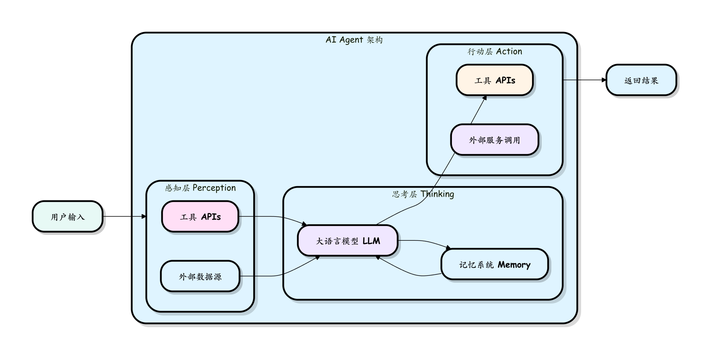
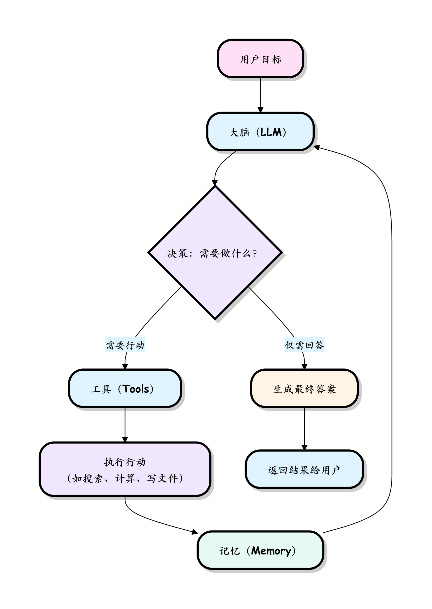

# 学习周报（202603013）

## 1. 初识 Agent 
Agent 本质是具备自动执行任务能力的程序，核心区别于传统聊天机器人：
- 传统聊天机器人仅被动回答问题，而 Agent 能主动思考、按步骤完成动作，是“能动手做事的智能”，而非单纯的问答工具。
- 核心特征：主动性、行动性，能力覆盖范围远大于传统问答机器人。

## 2. 拆解 Agent 核心构成
`Agent = LLM (大脑) + Planning (规划) + Tool use (执行) + Memory (记忆)`，各模块作用如下：
- LLM（大语言模型）：作为核心“大脑”，提供认知和决策基础；
- Planning（规划）：针对任务拆解步骤、制定执行策略；
- Tool use（工具使用）：落地执行动作，完成具体任务；
- Memory（记忆）：存储任务相关信息，支撑持续决策和动作调整。

## 3. Agent 架构与工作原理
  
  
