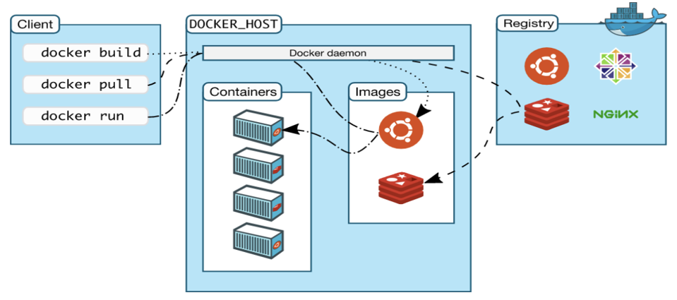

# 学习周报（20260417）

# Docker
## 一、Docker 到底是什么
**Docker 是一个开源的容器化平台**，可以把应用和它依赖的所有环境（库、配置、文件）打包成一个**独立、可移植、可随时运行**的容器。

## 二、容器 vs 虚拟机
# 虚拟机 vs Docker 容器 对比表
| 特性 | 虚拟机（VM） | Docker 容器 |
| :--- | :--- | :--- |
| 隔离级别 | 硬件级别虚拟化 | 操作系统级别虚拟化 |
| 操作系统 | 每个VM需要完整独立OS | 共享宿主机操作系统内核 |
| 资源占用 | 重量级，占用资源较多 | 轻量级，资源占用少 |
| 启动时间 | 分钟级别 | 秒级别 |
| 性能开销 | 开销较大 | 接近原生性能 |
| 镜像大小 | GB 级别 | MB 级别 |

## 三、Docker 三大核心
### 1. 镜像（Image）
- 只读模板，相当于**应用的安装包 + 运行环境**
- 例如：`nginx`、`mysql`、`python:3.10`、`tomcat`
- 可以自己构建，也可以从 Docker Hub 下载

### 2. 容器（Container）
- 镜像**运行起来的实例**就是容器
- 可启动、停止、删除
- 相互隔离，互不影响

### 3. Docker 仓库（Registry）
- 存放镜像的地方
- 最大公共仓库：**Docker Hub**
- 企业内部可搭建私有仓库（Harbor）

## 四、Docker架构

工作流程
1. 编写 `Dockerfile`（构建镜像的脚本）
2. 构建镜像 `docker build`
3. 推送镜像到仓库 `docker push`
4. 拉取镜像 `docker pull`
5. 运行容器 `docker run`

---

# Kubernetes
## 一、定义
**Kubernetes（简称 K8s）** 是 Google 开源的**容器编排平台**，用于自动化管理容器集群（Docker 等）。

## 二、K8s 解决问题
| 场景 | 没有 K8s（纯容器） | 有 K8s（容器编排） |
| :--- | :--- | :--- |
| 容器异常 | 容器挂了需要手动重启 | 容器崩溃自动重启、自动恢复 |
| 流量压力 | 流量突增需手动添加容器 | 流量变大自动扩容、流量下降自动缩容 |
| 多服务器管理 | 多台服务器容器分散、难以统一管控 | 多机统一调度、集中管理 |
| 版本发布 | 发布新版本容易停服、风险高 | 支持不停机发布、一键回滚 |
| 访问调度 | 需手动配置负载均衡 | 内置自动负载均衡 |

## 三、核心架构（Master + Node）
### 1. Master 节点（控制平面）
负责整个集群的管理与调度。
- **etcd**：键值存储，保存集群所有配置
- **kube-apiserver**：集群唯一入口，所有操作都走它
- **kube-scheduler**：调度 Pod 到哪个 Node 运行
- **kube-controller-manager**：控制器，保证期望状态

### 2. Node 节点（工作节点）
真正运行容器的机器。
- **kubelet**：管理本机 Pod，与 Master 通信
- **kube-proxy**：网络代理，实现 Service 负载均衡
- **容器运行时**：Docker / containerd

## 四、K8s 核心资源对象
### 1. Pod
- K8s **最小调度单位**
- 一个 Pod 包含一个或多个容器
- 同一 Pod 内容器共享网络和存储

### 2. Deployment
- 最常用的工作负载
- 管理 Pod 副本数量
- 支持**滚动更新、回滚、自愈**

### 3. Service
- 为一组 Pod 提供**固定访问地址**
- 自动负载均衡
- 类型：ClusterIP / NodePort / LoadBalancer

### 4. ConfigMap / Secret
- ConfigMap：存放配置文件
- Secret：存放密码、密钥等敏感信息

### 5. Volume
- 容器数据持久化存储
- 避免容器删除数据丢失

### 6. Namespace
- 集群资源隔离
- 用于区分环境：dev、test、prod

## 五、典型工作流程
1. 开发打包应用为 Docker 镜像
2. 推送镜像到仓库（Docker Hub / Harbor）
3. 编写 YAML 部署文件（Deployment/Service）
4. kubectl apply 部署到 K8s
5. K8s 自动创建 Pod、调度、负载均衡
6. 自动监控、自愈、扩缩容

---
## Docker vs K8s 关系
| 模块 | 作用 |
| :--- | :--- |
| **Docker** | 打包应用为容器，运行单个容器 |
| **K8s** | 批量管理容器集群，自动化运维 |

---

# 消息队列
## 一、消息队列是什么
**消息队列（Message Queue，简称 MQ）**
是一种**应用间通信的中间件**，用来在分布式系统里传递数据，实现**异步、解耦、削峰**。

## 二、核心作用
### 1. 异步处理
不用同步等待，提高响应速度
例：注册成功后发短信、发邮件，不用等执行完再返回

### 2. 应用解耦
系统之间不直接调用，通过消息通信
A 系统不关心 B 系统是否在线、是否正常

### 3. 流量削峰
高并发时先把请求存进队列，服务器慢慢消费
例：秒杀、双十一、抢票，防止系统直接被打崩

## 三、不同消息队列
# RabbitMQ / RocketMQ / Kafka 对比表
| 分类 | 详细项 | RabbitMQ | RocketMQ | Kafka |
| :--- | :--- | :--- | :--- | :--- |
| **一、基本介绍** | 开发语言 | Erlang | Java | Scala + Java |
| | 定位 | 老牌成熟轻量消息队列 | 阿里开源，高吞吐高可靠 | 分布式流处理平台 |
| | 协议 | AMQP | 私有协议 | 自有 TCP 协议 |
| **二、核心特点** | 消息功能 | 延时、死信、优先级队列完善 | 事务消息、延时、重试、死信 | 侧重高吞吐，功能简单 |
| | 路由/分发 | direct/topic/fanout/headers 灵活 | 主题、队列模式丰富 | 基于主题+分区 |
| | 性能机制 | 可靠稳定 | 高吞吐、抗秒杀 | 顺序写磁盘+页缓存，极致吞吐 |
| | 生态集成 | 通用微服务生态 | 国内 Java 生态强 | Flink/Spark/ELK 大数据生态 |
| **三、优点** | 易用性 | 上手简单，管理界面友好 | Java 友好，易二次开发 | 扩展性极强 |
| | 稳定性 | 稳定性强 | 大规模生产验证 | 高可靠、易扩容 |
| | 功能/生态 | 功能丰富，社区文档全 | 功能全面，适合金融电商 | 全球生态极强，大数据标配 |
| **四、缺点** | 吞吐量 | 一般，海量场景较弱 | 高 | 极高 |
| | 定制难度 | Erlang 难以二次开发 | 配置较复杂 | 业务级功能较弱 |
| | 其他缺点 | - | 国外生态一般 | 需业务自行处理幂等 |
| **五、适用场景** | 典型场景 | 中小型项目、微服务解耦 | 电商金融、秒杀、分布式事务 | 日志收集、流计算、大数据 |
| | 业务类型 | 订单、支付、通知、延时消息 | 核心链路、可靠消息 | 用户埋点、日志、监控 |
| | 适合团队 | 中小团队、低成本运维 | 中大型互联网公司 | 大数据、基础架构团队 |

